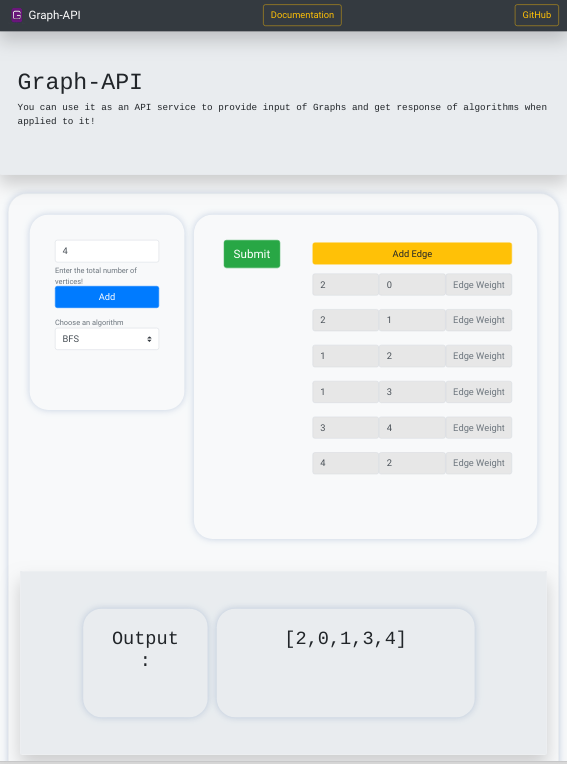

<div align="center">
<!-- ALL-CONTRIBUTORS-BADGE:START - Do not remove or modify this section -->
[](#contributors-)
<!-- ALL-CONTRIBUTORS-BADGE:END -->
<h1>Graph-API</h1>
<p>Backend containing all the algorithms of graphs.</p>
</div>

## Description

<div align="center">

</div>

This project achieves to provide all the basic algorithms associated with graphs to available as an **API** endpoint.
The request can be made as a **POST** request and the body should contain the **JSON** data of the edge list that defines
the graph. If the data is correctly parsed, a suitable algorithm can be applied to it to return a result of the
vertices(currently) or metadata associated to it. Below are some examples that demonstrate the usage of the rest-api.

If you want to check the return values, then check the main page for accessing the algorithms.

Currently, we are in a beta stage, so only **BFS** and **DFS** have been added.

## List of Algorithms supported

Since we are in beta stage, only **BFS** and **DFS** have been added. We are planning to add
the following algorithms -

### GRAPH TRAVERSAL :

- [x] DFS / BFS
- [ ] TopoSort / Cycle Detection
- [ ] Finding connected components (Undirected)
- [ ] Flood Fill
- [ ] Topological Sort (Directed acyclic graph)
- [ ] Bipartite graph check
- [ ] Graph edges property check via DFS spanning tree
- [ ] Finding articulation points and bridges
- [ ] Finding strongly connected components in directed

### MINIMUM SPANNING TREE :

- [ ] Kruskal
- [ ] Prim

### SINGLE SOURCE SHORTEST PATH :

- [ ] SSSP on unweighted graph
- [ ] SSSP on weighted graph
- [ ] SSSP on Graph with negative weight cycle

### ALL PAIRS SHORTEST PATH :

- [ ] Floyd Warshall's Algo

### NETWORK FLOW:

- [ ] Ford Fulkerson's Method
- [ ] Edmond Karp's Algo
- [ ] Flow Graph Modelling

### SPECIAL GRAPHS :

- [ ] Directed Acyclic graph
- [ ] Tree
- [ ] Eulerian Graph
- [ ] Bipartite Graph

# Using the Graph-API

There are two ways to use Graph-API.

- [Use the web version](https://graph-apiv1.herokuapp.com)
- Make a POST request

## Making a POST request

We are using the command line terminal to request the graph-api. You can make the same request using other languages
at the API Endpoint - `http://graph-apiv1.herokuapp.com/api`

```
curl -H "Content-Type: application/json" --data @body.json http://graph-apiv1.herokuapp.com/api

# body.json contains the JSON data of the request
```

## Format of the JSON request

Since at the beta stage we are supporting only 2 algorithms, the JSON format of the request is rather simple -
Supported Algorithms -

- `"algo" : "bfs"` BFS
- `"algo" : "dfs"` DFS

```
{"algo" : "bfs", "values" : [{"src" : "0", "dest" : "1", "weight" : "11"},{"src" : "1", "dest" : "2", "weight" : "11"},{"src" : "2", "dest" : "3", "weight" : "11"},{"src" : "3", "dest" : "0", "weight" : "11"}]}
```

## Support

If there are any issues with the API or the web-app, please create [an issue](https://github.com/Graph-Visualization/graph-api/issues/new).<br>
_Open Source Project made with love by Yash Sharma [`@yashrsharma44`](https://github.com/yashrsharma44) and Biswajit Ghosh [`@Biswajitghosh98`](https://github.com/Biswajitghosh98)_

## Contributors ✨

Thanks goes to these wonderful people ([emoji key](https://allcontributors.org/docs/en/emoji-key)):

<!-- ALL-CONTRIBUTORS-LIST:START - Do not remove or modify this section -->
<!-- prettier-ignore-start -->
<!-- markdownlint-disable -->
<table>
  <tr>
    <td align="center"><a href="https://yashrsharma44.github.io"><br /><sub><b>Yash Sharma</b></sub></a><br /><a href="https://github.com/codewithvk/graph-api/commits?author=yashrsharma44" title="Code">💻</a></td>
    <td align="center"><a href="https://github.com/Biswajitghosh98"><br /><sub><b>Biswajit Ghosh</b></sub></a><br /><a href="https://github.com/codewithvk/graph-api/commits?author=Biswajitghosh98" title="Code">💻</a></td>
  </tr>
</table>

<!-- markdownlint-enable -->
<!-- prettier-ignore-end -->
<!-- ALL-CONTRIBUTORS-LIST:END -->

This project follows the [all-contributors](https://github.com/all-contributors/all-contributors) specification. Contributions of any kind welcome!